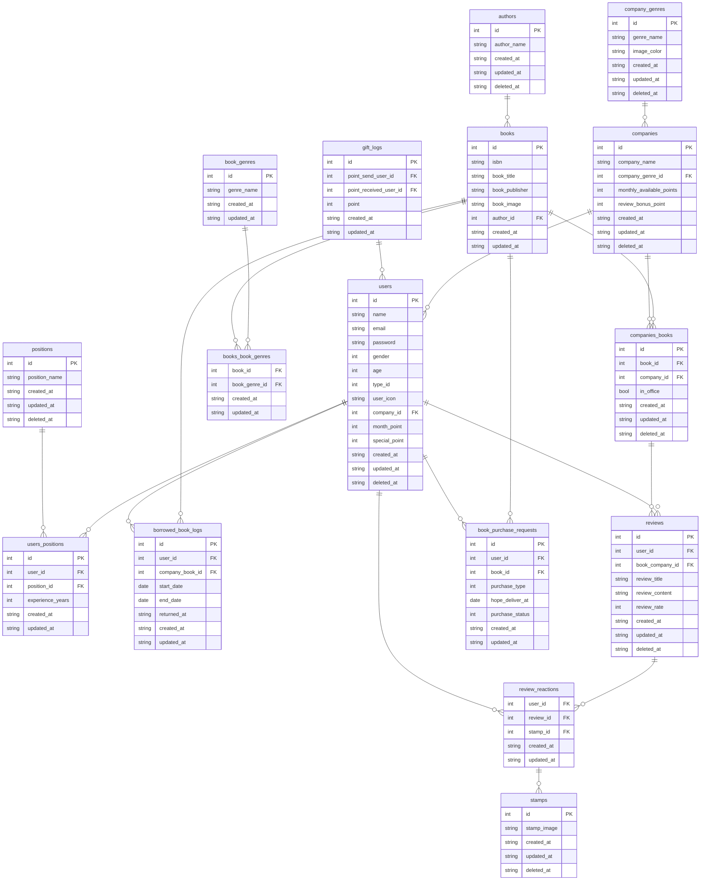

# LibCone - 企業の書籍管理アプリ

LibConeは、企業内の書籍の貸出、社員への書籍購入補助(福利厚生)をシステム化するアプリケーションです。ただシステム化するだけでなく、社員同士の「connection」ができるのがこのアプリです。このアプリを通じて社員は「書籍を読んだ上で得た知識や考え」・「自分の学習履歴」を共有し合ったり、書籍購入に必要な「special_pointをプレゼント」し合えたりします。special_pointは書籍への口コミや評価をすると獲得できる仕組みになっているため、社員の学習意欲向上が狙えます。
「憧れのあの先輩はこんな書籍を読んできたのか」「新卒のあの人にpointギフトするか」「みんな書籍で学習しているし自分も学ぼうかな」といった気持ちになるような企業文化を作ることが目標です。

## 目次
- [機能概要](#機能概要)
  - [社員向け機能](#社員向け機能)
  - [管理者向け機能](#管理者向け機能)
  - [カスタマイズ機能](#カスタマイズ機能)
- [非対応機能](#非対応機能)
- [インストール](#インストール)
- [型解析とコード整形の実行コマンド](#型解析とコード整形の実行コマンド)
- [テーブル設計](#テーブル設計)
- [API設計](#API設計)

---

## 機能概要

### 社員向け機能
- **登録・認証**  
  - 社員としての登録、ログイン、ログアウト機能
- **書籍の貸出と返却** 
  - 書籍バーコードをスキャンし、書籍情報を自動取得。借りたい場合は「借りるボタン」で貸出履歴が記録され、返却時はアプリ内から「返却ボタン」で返却が記録されます。
- **書籍一覧の参照**  
  - 社内の書籍一覧、貸出情報、貸出者履歴、社内書籍口コミを閲覧可能
  - 楽天bookAPIで取得した書籍の中から購入リクエストができて、それらは管理者へ通知される。購入リクエストをする際にuserが所持しているpoint(1pt=1円)を消費する。月毎にchargeされ1ヶ月経つと消えるmonthly_pointと,口コミ投稿で得られるspecial_pointが存在。
- **評価と口コミ**  
  - 社内図書に対し、5段階評価と口コミを投稿可能。口コミを投稿すると、月毎に消えないspecial_pointを獲得でき、他の社員へ贈ることも可能。
  - 口コミには「いいね」機能を備え、他の社員の口コミに多様なスタンプでリアクション可能 
- **読書記録**
  - マイページにて自分の読書ログと残point含むuser情報を閲覧可能
  - 他ユーザーの読書ログを閲覧可能
  - 読書ログはバーチャル本棚としての閲覧も可能
  - 日々の読書内容、ページ数、学んだことを記録していける(未実装)

### 管理者向け機能
- **登録・認証**  
  - 管理者としての登録、ログイン、ログアウト機能
- **口コミ管理**  
  - 社内口コミの閲覧・削除が可能
- **書籍リクエスト管理とポイント設定**  
  - 社員からの書籍リクエストを一覧表示し、管理者が決定・注文
  - ポイント管理として、社員ごとの所有ポイントの設定・閲覧・編集が可能 (未実装)
- **書籍と貸出情報の管理**
  - 社内書籍の一覧や貸出情報、貸出者履歴を管理。書籍の新規追加・編集・削除が可能

### カスタマイズ機能  
  - 社員は、書籍購入の希望先を「会社」または「個人」で選択可能(企業がどちらかのみに絞ることも可能)
  - 各企業、月毎に利用可能なpoint数を任意の値に設定可能
  - 各企業、口コミを投稿した際に獲得できるpoint数を任意の値に設定可能

## 非対応機能

LibConeは以下の機能には対応しません。
- **社員向け**
  - 口コミへのコメント投稿
  - 個別ユーザーへのメッセージ送信
- **管理者向け**
  - 個別ユーザーへのメッセージ送信
  - 社員が投稿した口コミや評価の編集

## インストール

インストール手順については以下を参照してください。

```bash
# リポジトリをクローン
git clone https://github.com/HashimotoShuhei-z/LibCone-backend.git
cd LibCone-backend/src

# 必要な依存をインストール
docker-compose up --build

# appコンテナに入る
docker compose exec app bash

# laravel内でcomposer install
cd/src
composer install
```

## 型解析とコード整形の実行コマンド
```bash
# larastan実行(型解析)
./vendor/bin/phpstan analyse

# php-cs-fixer実行(コード整形)
./vendor/bin/php-cs-fixer fix
```

## テーブル設計


## API設計
- 以下のリンクからyml形式のswaggerを閲覧できます。
  - (https://github.com/HashimotoShuhei-z/LibCone-front/blob/main/openapi/openapi.yml)

